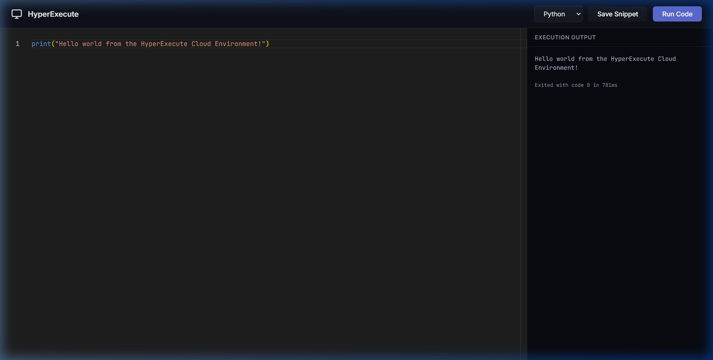

# ⚡ HyperExecute

A high-performance online code execution platform built with **Rust**, featuring a sleek Monaco Editor-based interface and real-time code execution for Python, JavaScript, and C++.



---

## ✨ Features

- 🚀 **Blazing Fast** — Built entirely in Rust with Axum for sub-millisecond API latency
- 🎨 **Monaco Editor** — VS Code-grade editing with syntax highlighting and IntelliSense
- 🐍 **Multi-Language** — Execute Python, JavaScript (Node.js), and C++ code
- 💾 **Save & Share** — Save code snippets with unique shareable URLs
- 🔒 **Sandboxed Execution** — 10-second timeout and process isolation
- 🌙 **Dark Theme** — Beautiful dark UI with glassmorphism design

---

## 🏗️ Architecture

```
┌─────────────────────────────────────────────┐
│                  Browser                     │
│         Monaco Editor + Dark UI              │
└──────────────────┬──────────────────────────┘
                   │ HTTP POST /execute
┌──────────────────▼──────────────────────────┐
│              Axum Server (Rust)               │
│  ┌─────────┐  ┌──────────┐  ┌────────────┐  │
│  │ REST API│  │ Executor │  │  SQLite DB │  │
│  │ Routes  │  │ (python, │  │ (snippets) │  │
│  │         │  │  node,   │  │            │  │
│  │         │  │  g++)    │  │            │  │
│  └─────────┘  └──────────┘  └────────────┘  │
└─────────────────────────────────────────────┘
```

**Workspace Structure:**

```
hyperexecute/
├── server/          # Axum REST API server
│   ├── src/
│   │   ├── main.rs      # Server entrypoint
│   │   ├── api.rs       # Route handlers
│   │   ├── queue.rs     # In-process code executor
│   │   └── db.rs        # SQLite database service
│   └── static/
│       └── index.html   # Frontend UI
├── shared/          # Shared types & models
│   └── src/
│       ├── lib.rs
│       └── models.rs    # Language, ExecutionJob, ExecutionResult
├── worker/          # Worker (optional, for Docker mode)
├── Dockerfile       # Production deployment
├── fly.toml         # Fly.io deployment config
└── Cargo.toml       # Workspace config
```

---

## 🚀 Quick Start

### Prerequisites

- [Rust](https://rustup.rs/) (1.75+)
- Python 3 (for Python execution)
- Node.js (for JavaScript execution)
- G++ (for C++ execution) — *optional*

### Run Locally

```bash
# Clone the repo
git clone https://github.com/YOUR_USERNAME/hyperexecute.git
cd hyperexecute

# Build and run
cargo run --bin server
```

Open **http://localhost:8080** in your browser. That's it!

---

## 📡 API Endpoints

| Method | Endpoint | Description |
|--------|----------|-------------|
| `POST` | `/execute` | Execute code and return output |
| `POST` | `/save` | Save a code snippet |
| `GET` | `/load/:id` | Load a saved snippet by ID |
| `GET` | `/health` | Health check |

### Example: Execute Code

```bash
curl -X POST http://localhost:8080/execute \
  -H "Content-Type: application/json" \
  -d '{"language": "Python", "code": "print(\"Hello, World!\")"}'
```

**Response:**
```json
{
  "job_id": "3ce3c4f6-45f8-4958-8281-af04ce635c89",
  "stdout": "Hello, World!\n",
  "stderr": "",
  "exit_code": 0,
  "time_taken_ms": 479,
  "error": null
}
```

---

## 🐳 Docker Deployment

```bash
docker build -t hyperexecute .
docker run -p 8080:8080 hyperexecute
```

---

## ☁️ Deploy to Fly.io (Free)

```bash
# Install Fly CLI
curl -L https://fly.io/install.sh | sh

# Login and deploy
fly auth login
fly launch
```

Your app will be live at `https://your-app.fly.dev`

---

## 🛠️ Tech Stack

| Component | Technology |
|-----------|------------|
| Backend | Rust, Axum, Tokio |
| Frontend | HTML, CSS, Monaco Editor |
| Database | SQLite (via sqlx) |
| Execution | System processes (python, node, g++) |
| Deployment | Docker, Fly.io |

---

## 📄 License

MIT License — see [LICENSE](LICENSE) for details.
