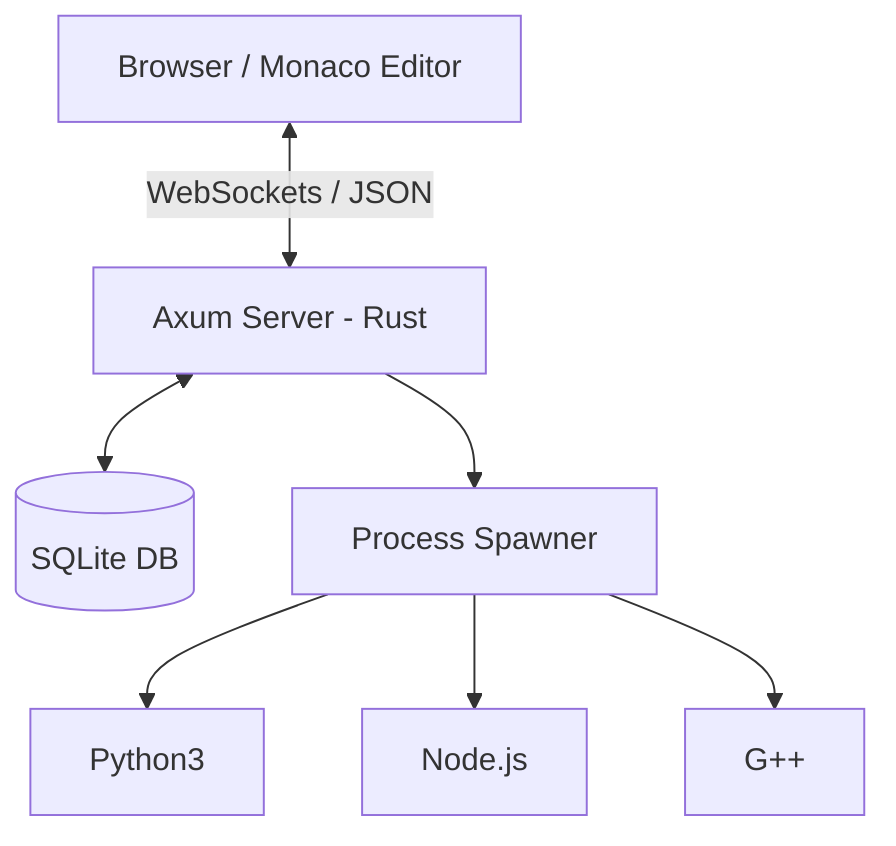

# ⚡ HyperCompiler: Digital Anarchy

A high-performance, interactive online compiler and code execution platform built with **Rust**. Featuring a high-fidelity cyberpunk "Digital Anarchy" interface, real-time terminal streaming via WebSockets, and a VS Code-grade editing experience.


---

## ✨ Features

- 💀 **Digital Anarchy UI** — High-fidelity cyberpunk aesthetic with glassmorphism, CRT scanlines, and neon accents.
- 🐚 **Interactive Terminal** — Real-time stdin/stdout streaming using **WebSockets** and **xterm.js**.
- 🚀 **Blazing Fast** — Built with Axum and Tokio for extremely low-latency code execution.
- 🎨 **Monaco Editor** — Professional-grade code editing with full syntax highlighting.
- 🐍 **Multi-Language Support** — Native execution for **Python**, **JavaScript (Node.js)**, and **C++**.
- 💾 **Persistence** — Save snippets and retrieve them later with unique IDs.
- 🔒 **Sandboxed Execution** — Built-in timeouts and process isolation for secure runs.

---

## 🏗️ Architecture



---

## 🚀 Quick Start

### Prerequisites

- [Rust](https://rustup.rs/) (1.75+)
- Python 3
- Node.js
- G++ (for C++ support)

### Run Locally

```bash
# Clone the repository
git clone https://github.com/THEN01EXPLORER/hyperexecute-rs.git
cd hyperexecute-rs

# Start the server
cargo run --release --bin server
```

Open **http://localhost:8080** in your browser.

---

## 📡 API & Real-time Endpoints

| Type | Endpoint | Description |
|------|----------|-------------|
| `WS` | `/ws/execute` | Real-time interactive execution (xterm.js) |
| `POST` | `/execute` | Legacy stateless code execution |
| `POST` | `/save` | Save a code snippet |
| `GET` | `/load/:id` | Load a saved snippet |
| `GET` | `/health` | Server health check |

---

## ☁️ Deployment

### Deploy to Render (Recommended)

1. **Create a New Web Service** on Render.
2. Connect this GitHub repository.
3. **CRITICAL:** Set the **Environment** to `Docker`.
   - *Why?* This ensures Python, Node, and G++ are installed alongside the Rust server.
4. Render will automatically detect the `Dockerfile` and deploy.

### Environment Variables

| Variable | Default | Description |
|----------|---------|-------------|
| `PORT` | `8080` | Port to bind the server to |
| `DATABASE_URL` | `sqlite:snippets.db` | Path to the SQLite database |

---

## 🛠️ Tech Stack

- **Backend:** Rust, Axum, Tokio, SQLx (SQLite)
- **Frontend:** Vanilla JS, Monaco Editor, xterm.js, Tailwind CSS
- **Design:** Digital Anarchy / Cyberpunk Aesthetic
- **Deployment:** Docker, Render

---

## 📄 License

MIT License — see [LICENSE](LICENSE) for details.

---
Created by [THEN01EXPLORER](https://github.com/THEN01EXPLORER)
